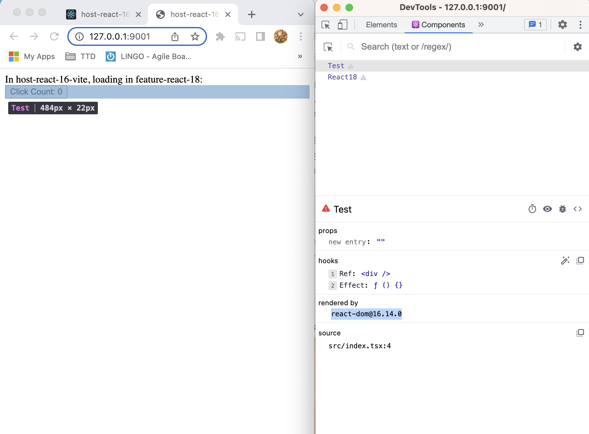

# Steps to recreate issue

> Install all workspace packages
```bash
yarn workspaces foreach install
```

> Build the "feature" package with a dependency on React 18 and run both vite and webpack servers
```bash
yarn run clean-start
```

# Issue Recap / Context
In Vite, different versions of a package look like they are being resolved to a single version. 

In this example, we will demonstrate this with React. We have a feature package called `feature-react-18` with a dependency on `react@^18.2.0`. Our "host" apps will have a dependency on `react@^16.14.0`.

If we run `host-react-16-webpack`, we can run a server with react 16 and use our `feature-react-18` to mount a new react tree that's using react 18. The screenshots below shows this expected behavior:
<center>
    %>
    <div>[Webpack] Host rendered using react 16</div>
</center>
</br>

<center>
    
    <div>[Webpack] Feature rendered using react 18</div>
</center>
</br>
<hr/>

In `host-react-16-vite`, the imports point to the same version of react, which is the one loaded in by the host:
<center>
    %>
    <div>[Vite] Host rendered using react 16</div>
</center>
</br>

<center>
    
    <div>[Vite] Feature rendered using react 16, instead of v18</div>
</center>
</br>
<hr/>

Digging deeper into the imports, these screenshots show that webpack separates the different react versions between the host and feature.
<center>
    %>
    <div>[Webpack] In the host, the imported react module is on version 16</div>
</center>
</br>

<center>
    
    <div>[Webpack] In the feature, the imported react module is on version 18</div>
</center>
</br>
<hr/>

However, in Vite, the react versions are the same between the host and feature.
<center>
    %>
    <div>[Vite] In the host, the imported react module is on version 16</div>
</center>
</br>

<center>
    
    <div>[Vite] In the feature, the imported react module is still on version 16</div>
</center>
</br>